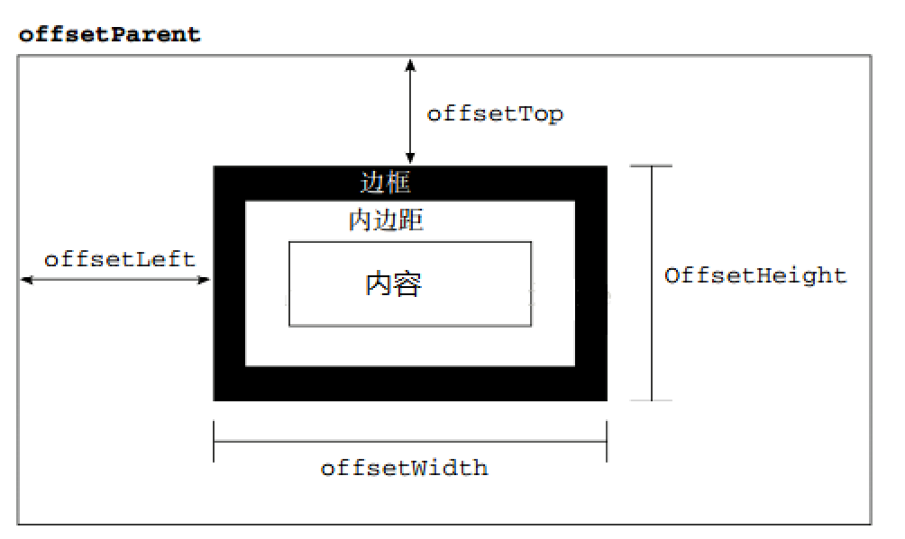
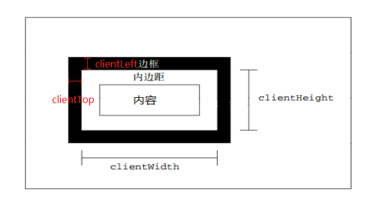
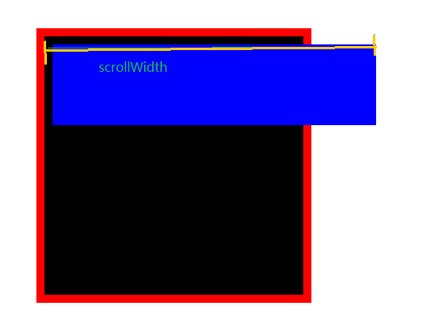
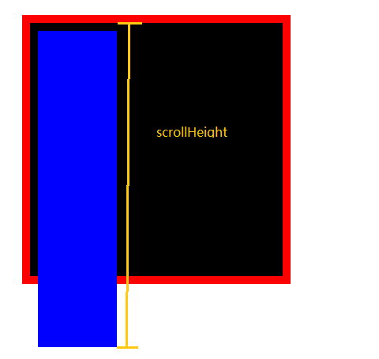
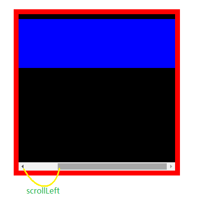
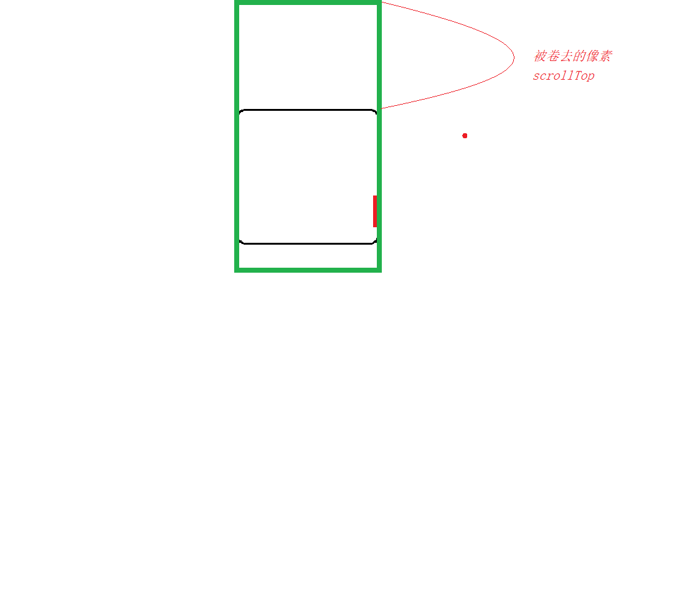
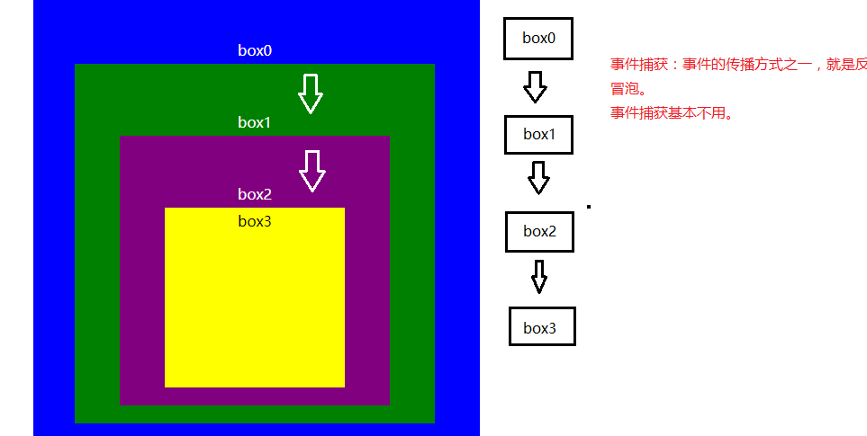

# webAPI 第五天

## 一. 三大系列

### 1.1 offset系列

+ 节点对象.offsetWidth 和 节点对象.offsetHeight

  > + 节点对象.offsetWidth
  >
  >   + 作用：获取当前节点对象的宽度，返回数字，不包含单位。
  >   + 宽度：width + padding(左右) + border（左右）;
  >
  > + 节点对象.offsetHeight
  >
  >   + 作用：获取当前节点对象的高度，返回数字，不包含单位。
  >   + 高度：height + padding(上下) + border(上下)
  >
  > + 代码：
  >
  >   ```html
  >   <!DOCTYPE html>
  >   <html>
  >   <head lang="en">
  >     <meta charset="UTF-8">
  >     <title></title>
  >     <style>
  >       div {
  >         width: 100px;
  >         height: 100px;
  >         padding:10px;
  >         border:5px solid red;
  >         background-color: blue;
  >       }
  >     </style>
  >   </head>
  >   <body>
  >     <div></div>
  >     <script>
  >       var divNode = document.querySelector('div');
  >       //width(100) + padding(左10 右10) + border(左5 右5)
  >       console.log(divNode.offsetWidth);//130
  >       //height(100) + padding(上10 下10) + border(上5 下5)
  >       console.log(divNode.offsetHeight);//130
  >     </script>
  >   </body>
  >   </html>
  >   ```

+ 节点对象.offsetLeft 和 节点对象.offsetTop

  > + 节点对象.offsetLeft 
  >
  >   + 作用：获取当前节点对象的x坐标，相对于其最近的定位的上级元素的坐标。否则，相对于body。
  >
  > + 节点对象.offsetTop
  >
  >   + 作用：获取当前节点对象的y坐标，相对于其最近的定位的上级元素的坐标。否则，相对于body。
  >
  > + 代码1：
  >
  >   ```html
  >   <!DOCTYPE html>
  >   <html>
  >   <head lang="en">
  >     <meta charset="UTF-8">
  >     <title></title>
  >     <style>
  >       * {
  >         margin:0;
  >         padding:0;
  >       }
  >       .father {
  >         width: 300px;
  >         height: 300px;
  >         background-color:blue;
  >         margin:50px auto;
  >         border:1px solid blue;
  >         position: relative;
  >       }
  >       .son {
  >         width:200px;
  >         height: 200px;
  >         margin:50px auto;
  >         background-color: #000;
  >       }
  >     </style>
  >   </head>
  >   <body>
  >     	<!--父元素是定位的-->
  >       <div class="father">
  >         <div class="son"></div>
  >       </div>
  >       <script>
  >         var sonNode = document.querySelector('.son');
  >         console.log(sonNode.offsetLeft);//50  参照定位的父元素
  >         console.log(sonNode.offsetTop); //50  参照定位的父元素
  >       </script>
  >   </body>
  >   </html>
  >   ```
  >
  > + 代码2：
  >
  >   ```html
  >   <!DOCTYPE html>
  >   <html>
  >   <head lang="en">
  >     <meta charset="UTF-8">
  >     <title></title>
  >     <style>
  >       * {
  >         margin:0;
  >         padding:0;
  >       }
  >       .father {
  >         width: 300px;
  >         height: 300px;
  >         background-color:blue;
  >         margin:50px auto;
  >         border:1px solid blue;
  >       }
  >       .son {
  >         width:200px;
  >         height: 200px;
  >         margin:50px auto;
  >         background-color: #000;
  >       }
  >     </style>
  >   </head>
  >   <body>
  >       <!-- 父元素的没有定位-->
  >       <div class="father">
  >         <div class="son"></div>
  >       </div>
  >       <script>
  >         var sonNode = document.querySelector('.son');
  >         console.log(sonNode.offsetLeft);//406  参照body
  >         console.log(sonNode.offsetTop);//101   参照body
  >       </script>
  >   </body>
  >   </html>
  >   ```

+ 节点对象.offsetParent

  > + 作用：获取节点对象的最近的定位的上级节点对象
  >
  > + 代码1：
  >
  >   ```html
  >   <!DOCTYPE html>
  >   <html>
  >   <head lang="en">
  >     <meta charset="UTF-8">
  >     <title></title>
  >     <style>
  >       * {
  >         margin:0;
  >         padding:0;
  >       }
  >       .father {
  >         width: 300px;
  >         height: 300px;
  >         background-color:blue;
  >         margin:50px auto;
  >         border:1px solid blue;
  >         position: relative;
  >       }
  >       .son {
  >         width:200px;
  >         height: 200px;
  >         margin:50px auto;
  >         background-color: #000;
  >       }
  >     </style>
  >   </head>
  >   <body>
  >       <!-- 父元素有定位-->
  >       <div class="father">
  >         <div class="son"></div>
  >       </div>
  >       <script>
  >         var sonNode = document.querySelector('.son');
  >         var parent = sonNode.offsetParent;
  >         console.log(parent); //获取定位的上级元素，div.father
  >       </script>
  >   </body>
  >   </html>
  >   ```
  >
  > + 代码2：
  >
  >   ```html
  >   <!DOCTYPE html>
  >   <html>
  >   <head lang="en">
  >     <meta charset="UTF-8">
  >     <title></title>
  >     <style>
  >       * {
  >         margin:0;
  >         padding:0;
  >       }
  >       .father {
  >         width: 300px;
  >         height: 300px;
  >         background-color:blue;
  >         margin:50px auto;
  >         border:1px solid blue;
  >       }
  >       .son {
  >         width:200px;
  >         height: 200px;
  >         margin:50px auto;
  >         background-color: #000;
  >       }
  >     </style>
  >   </head>
  >   <body>
  >       <!-- 父元素没有定位-->
  >       <div class="father">
  >         <div class="son"></div>
  >       </div>
  >       <script>
  >         var sonNode = document.querySelector('.son');
  >         var parent = sonNode.offsetParent;
  >         console.log(parent); //因为没有最近的定位的上级元素，所以获取body
  >       </script>
  >   </body>
  >   </html>
  >   ```

+ 图示offset系列

  > 

  ​

### 1.2 client系列

+ 节点对象.clientWidth   和   节点对象.clientHeight

  > + 节点对象.clientWidth
  >
  >   + 作用：获取当前节点对象的宽度，返回数字，不包含单位。
  >   + 宽度：width + padding(左右) ;
  >
  > + 节点对象.clientHeight
  >
  >   + 作用：获取当前节点对象的高度，返回数字，不包含单位。
  >   + 高度：height + padding(上下);
  >
  > + 代码：
  >
  >   ```html
  >   <!DOCTYPE html>
  >   <html>
  >   <head lang="en">
  >     <meta charset="UTF-8">
  >     <title></title>
  >     <style>
  >       div {
  >         width: 100px;
  >         height: 100px;
  >         padding:10px;
  >         border:5px solid red;
  >         background-color: blue;
  >         margin: 100px auto;
  >       }
  >     </style>
  >   </head>
  >   <body>
  >     <div></div>
  >     <script>
  >       var divNode = document.querySelector('div');
  >       //width(100) + padding(左10 右10)
  >       console.log(divNode.clientWidth);//120
  >       //height(100) + padding(上10 下10)
  >       console.log(divNode.clientHeight);//120
  >     </script>
  >   </body>
  >   </html>
  >   ```
+ 节点对象.clientLeft       和   节点对象.clientTop  【几乎不用，了解】

  > + 节点对象.clientLeft;
  >
  >   + 作用：获取当前节点对象的padding-left的外边界，距离border-left外边界的距离。实际上就是左边框的厚度。
  >
  > + 节点对象.clientTop;
  >
  >   + 作用：获取当前节点对象的padding-top的外边界，距离border-top外边界的距离。实际上就是上边框的厚度。
  >
  > + 代码：
  >
  >   ```html
  >   <!DOCTYPE html>
  >   <html>
  >   <head lang="en">
  >     <meta charset="UTF-8">
  >     <title></title>
  >     <style>
  >       div {
  >         width: 200px;
  >         height: 200px;
  >         padding:10px;
  >         border:10px solid red;
  >         border-top:50px solid red;
  >         background-color: blue;
  >         margin: 100px auto;
  >       }
  >     </style>
  >   </head>
  >   <body>
  >   <div></div>
  >   <script>
  >     var divNode = document.querySelector('div');
  >     console.log(divNode.clientLeft);//10
  >     console.log(divNode.clientTop);//50
  >   </script>
  >   </body>
  >   </html>
  >   ```
+ 图示client系列

  > 

### 1.3 scroll系列

+ 节点对象.scrollWidth  和  scrollHieght

  > + 节点对象.scrollWidth  
  >
  >   + 作用:获取当前节点对象的宽度，返回数字，不包含单位。
  >
  >   + 宽度：width+padding（左右）+ 溢出部分
  >
  >   + 代码：
  >
  >     ```html
  >     <!DOCTYPE html>
  >     <html>
  >     <head lang="en">
  >       <meta charset="UTF-8">
  >       <title></title>
  >       <style>
  >         * {
  >           margin:0;
  >           padding:0;
  >         }
  >         .father {
  >           width:300px;
  >           height: 300px;
  >           background-color: #000;
  >           margin:100px auto;
  >           /*overflow: auto;*/
  >           padding: 10px;
  >           border:10px solid red;
  >         }
  >         .son {
  >           width: 400px;
  >           height: 100px;
  >           background-color: blue;
  >         }
  >       </style>
  >     </head>
  >     <body>
  >       <div class="father">
  >         <div class="son">
  >
  >         </div>
  >       </div>
  >       <script>
  >         var fNode = document.querySelector('.father');
  >         /*
  >           width + padding(左右)  包含溢出部分
  >         */
  >         console.log(fNode.scrollWidth); //410
  >       </script>
  >     </body>
  >     </html>
  >     ```
  >
  >   + 图示：
  >     
  >
  > + 节点对象.scrollHeight
  >
  >   + 作用：获取当前节点对象的高度，返回数字，不包含单位。
  >
  >   + 高度：height + padding(上下) + 溢出部分;
  >
  >   + 代码：
  >
  >     ```html
  >     <!DOCTYPE html>
  >     <html>
  >     <head lang="en">
  >       <meta charset="UTF-8">
  >       <title></title>
  >       <style>
  >         * {
  >           margin:0;
  >           padding:0;
  >         }
  >         .father {
  >           width:300px;
  >           height: 300px;
  >           background-color: #000;
  >           margin:100px auto;
  >           padding: 10px;
  >           border:10px solid red;
  >         }
  >         .son {
  >           width: 100px;
  >           height: 400px;
  >           background-color: blue;
  >         }
  >       </style>
  >     </head>
  >     <body>
  >       <div class="father">
  >         <div class="son">
  >
  >         </div>
  >       </div>
  >       <script>
  >         var fNode = document.querySelector('.father');
  >         /*
  >           height + padding(上下)  包含溢出部分
  >         */
  >         console.log(fNode.scrollHeight); //410
  >       </script>
  >     </body>
  >     </html>
  >     ```
  >
  >   + 图示：
  >     
+ 节点对象.scrollLeft     和   节点对象.scrollTop

  > + 节点对象.scrollLeft
  >
  >   + 作用：获取被卷去的横向宽度
  >
  >   + 代码：
  >
  >     ```html
  >     <!DOCTYPE html>
  >     <html>
  >     <head lang="en">
  >       <meta charset="UTF-8">
  >       <title></title>
  >       <style>
  >         * {
  >           margin:0;
  >           padding:0;
  >         }
  >         .father {
  >           width:300px;
  >           height: 300px;
  >           background-color: #000;
  >           margin:100px auto;
  >           padding: 10px;
  >           overflow: auto;
  >           border:10px solid red;
  >         }
  >         .son {
  >           width: 400px;
  >           height: 100px;
  >           background-color: blue;
  >         }
  >       </style>
  >     </head>
  >     <body>
  >       <div class="father">
  >         <div class="son">
  >
  >         </div>
  >       </div>
  >       <script>
  >         var fNode = document.querySelector('.father');
  >         fNode.onscroll = function(){
  >           console.log(fNode.scrollLeft);
  >         }
  >       </script>
  >     </body>
  >     </html>
  >     ```
  >
  >   + 图示：
  >     
  >
  > + 节点对象.scrollHeight
  >
  >   + 作用：获取被卷去的纵向高度
  >
  >   + 代码：
  >
  >     ```html
  >     <!DOCTYPE html>
  >     <html>
  >     <head lang="en">
  >       <meta charset="UTF-8">
  >       <title></title>
  >       <style>
  >         * {
  >           margin:0;
  >           padding:0;
  >         }
  >         .father {
  >           width:300px;
  >           height: 300px;
  >           background-color: #000;
  >           margin:100px auto;
  >           padding: 10px;
  >           overflow: auto;
  >           border:10px solid red;
  >         }
  >         .son {
  >           width: 100px;
  >           height: 400px;
  >           background-color: blue;
  >         }
  >       </style>
  >     </head>
  >     <body>
  >       <div class="father">
  >         <div class="son">
  >
  >         </div>
  >       </div>
  >       <script>
  >         var fNode = document.querySelector('.father');
  >         fNode.onscroll = function(){
  >           console.log(fNode.scrollTop);
  >         }
  >       </script>
  >     </body>
  >     </html>
  >     ```
  >
  >   + 图示：
  >     
  >     ​


## 二. 事件监听

### 2.1 什么是事件监听 【了解】

> ​	绑定事件的另一种方式。事件监听可以监听多个事件处理程序，也可以把指定的事	件处理程序从该事件中移除。

### 2.2 事件监听的方式绑定和解绑事件 【重要】

+ 标准方式

  > + 语法：
  >
  >   + 绑定
  >
  >     ```javascript
  >     事件目标.addEventListener(事件类型,事件处理程序,是否捕获);
  >     	事件目标：要绑定的那个节点对象。
  >     	事件类型：交互行为，在这里不加on
  >     	事件处理程序：函数
  >     	是否捕获:可选，布尔值，true是捕获，false是冒泡，默认为false;
  >     ```
  >
  >   + 解绑
  >
  >     ```javascript
  >     事件目标.removeEventListener(事件类型,事件处理程序的名称);
  >     	事件目标: 要解绑事件的那个节点对象
  >     	事件类型：解绑什么类型的实际，不加on
  >     	事件处理程序的名称：函数的名称；
  >     ```
  >
  > + 代码：
  >
  >   ```html
  >   <!DOCTYPE html>
  >   <html>
  >   <head lang="en">
  >     <meta charset="UTF-8">
  >     <title></title>
  >   </head>
  >   <body>
  >     <button id="btn">按钮</button>
  >     <button id="jb">解绑事件处理程序一</button>
  >     <script>
  >       var btn = document.querySelector('#btn');
  >       var jb = document.querySelector('#jb');
  >       /*事件处理程序一*/
  >       var test1 = function(){
  >        alert(1);
  >       };
  >       /*事件处理程序二*/
  >       var test2 = function(){
  >         alert(2);
  >       };
  >       btn.addEventListener('click',test1);  //绑定1
  >       btn.addEventListener('click',test2);  //绑定2
  >       //点击解绑按钮的事件处理程序二
  >       jb.onclick = function(){
  >         btn.removeEventListener('click',test2);
  >       };
  >     </script>
  >   </body>
  >   </html>
  >   ```

+ IE低版本方式

  > + 语法：
  >
  >   + 绑定：
  >
  >     ```javascript
  >     事件目标.attachEvent(事件类型,事件处理程序);
  >     	事件目标：要绑定的那个节点对象。
  >     	事件类型：交互行为，在这里要加on
  >     	事件处理程序：函数
  >     ```
  >
  >   + 解绑：
  >
  >     ```javascript
  >     事件目标.detachEvent(事件类型,事件处理程序的名称);
  >     	事件目标：要绑定的那个节点对象。
  >     	事件类型：交互行为，在这里要加on
  >     	事件处理程序的名称：函数名称
  >     ```
  >
  > + 代码：
  >
  >   ```html
  >   <!DOCTYPE html>
  >   <html>
  >   <head lang="en">
  >     <meta charset="UTF-8">
  >     <title></title>
  >   </head>
  >   <body>
  >   <button id="btn">按钮</button>
  >   <button id="jb">解绑事件处理程序一</button>
  >   <script>
  >     var btn = document.querySelector('#btn');
  >     var jb = document.querySelector('#jb');
  >     /*事件处理程序一*/
  >     var test1 = function(){
  >       alert(1);
  >     };
  >     /*事件处理程序二*/
  >     var test2 = function(){
  >       alert(2);
  >     };
  >     btn.attachEvent('onclick',test1); //绑定事件1
  >     btn.attachEvent('onclick',test2); //绑定事件2
  >
  >     //解绑事件2
  >     jb.onclick = function(){
  >       btn.detachEvent('onclick',test2); //解绑按钮的事件处理程序2
  >     };
  >   </script>
  >   </body>
  >   </html>
  >   ```

+ 兼容处理后绑定和解绑

  > + 语法：
  >
  >   + 绑定:
  >
  >     ```javascript
  >       /*
  >         功能：绑定事件
  >         参数：
  >           node 事件目标 节点对象
  >           type 事件类型 string 不加on
  >           handler 事件处理程序 函数
  >         返回值：无
  >       */
  >       function addEvent(node,type,handler){
  >         if(node.addEventListener){ //检测浏览器是否支持标准方式
  >           //支持
  >           node.addEventListener(type,handler);
  >         }else{
  >           //不支持
  >           node.attachEvent('on' + type,handler);
  >         }
  >       }
  >     ```
  >
  >   + 解绑：
  >
  >     ```javascript
  >       /*
  >         功能：解绑事件
  >         参数：
  >           node 事件目标  节点对象
  >           type 事件类型  string
  >           handlerName 事件处理程序名称 函数
  >         返回值：无
  >       */
  >       function removeEvent(node,type,handlerName){
  >         if(node.removeEventListener){//检测浏览器是否支持标准方式
  >           //支持
  >           node.removeEventListener(type,handlerName);
  >         }else{
  >           //不支持
  >           node.detachEvent('on' + type,handlerName);
  >         }
  >       }
  >     ```
  >
  > + 代码：
  >
  >   ```html
  >   <!DOCTYPE html>
  >   <html>
  >   <head lang="en">
  >     <meta charset="UTF-8">
  >     <title></title>
  >   </head>
  >   <body>
  >   <button id="btn">按钮</button>
  >   <button id="jb">解绑事件处理程序一</button>
  >   <script>
  >     /*
  >       功能：绑定事件
  >       参数：
  >         node 事件目标 节点对象
  >         type 事件类型 string 不加on
  >         handler 事件处理程序 函数
  >       返回值：无
  >     */
  >     function addEvent(node,type,handler){
  >       if(node.addEventListener){ //检测浏览器是否支持标准方式
  >         //支持
  >         node.addEventListener(type,handler);
  >       }else{
  >         //不支持
  >         node.attachEvent('on' + type,handler);
  >       }
  >     }
  >
  >     /*
  >       功能：解绑事件
  >       参数：
  >         node 事件目标  节点对象
  >         type 事件类型  string
  >         handlerName 事件处理程序名称 函数
  >       返回值：无
  >     */
  >     function removeEvent(node,type,handlerName){
  >       if(node.removeEventListener){//检测浏览器是否支持标准方式
  >         //支持
  >         node.removeEventListener(type,handlerName);
  >       }else{
  >         //不支持
  >         node.detachEvent('on' + type,handlerName);
  >       }
  >     }
  >     var btn = document.querySelector('#btn');
  >     var jb = document.querySelector('#jb');
  >     /*事件处理程序一*/
  >     var test1 = function(){
  >       alert(1);
  >     };
  >     /*事件处理程序二*/
  >     var test2 = function(){
  >       alert(2);
  >     };
  >     addEvent(btn,'click',test1);
  >     addEvent(btn,'click',test2);
  >
  >     //解绑事件2
  >     jb.onclick = function(){
  >       removeEvent(btn,'click',test2);
  >     };
  >   </script>
  >   </body>
  >   </html>
  >   ```

### 2.3 事件捕获 【了解】

+ 事件捕获介绍

  > 事件捕获，是事件传播的另外一种方式，和冒泡是相反的。捕获就是反冒泡。基本不用，了解知道就可以
  >
  > 传播方式：上级....→ 目标;
  > 

+ 代码：

  ```html

  <!doctype html>
  <html lang="en">
  <head>
      <meta charset="UTF-8">
      <meta name="Generator" content="EditPlus®">
      <meta name="Author" content="">
      <meta name="Keywords" content="">
      <meta name="Description" content="">
      <title>Document</title>
      <style>
          *{
              margin:0;
              padding:0;
              line-height:30px;
              text-align:center;
              color:#fff;

          }
          .box0{
              width:400px;
              height:400px;
              background-color:blue;
              padding:50px;
          }
          .box1{
              width:300px;
              height:300px;
              background-color:green;
              padding:50px;
          }
          .box2{
              width:200px;
              height:200px;
              background-color:purple;
              padding:50px;
          }
          .box3{
              width:200px;
              height:200px;
              background-color:yellow;
              color:#000;
          }
      </style>
  </head>
  <body>
  <div class="box0">
      box0
      <div class="box1">
          box1
          <div class="box2">
              box2
              <div class="box3">box3</div>
          </div>
      </div>
  </div>

  <script>
      var divs = document.getElementsByTagName("div");
      for(var i = 0;i<divs.length;i++){
          divs[i].addEventListener('click',function(){
              alert(this.className);
          },true);
      }
  </script>
  </body>
  </html>

  ```


